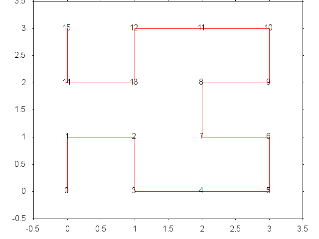
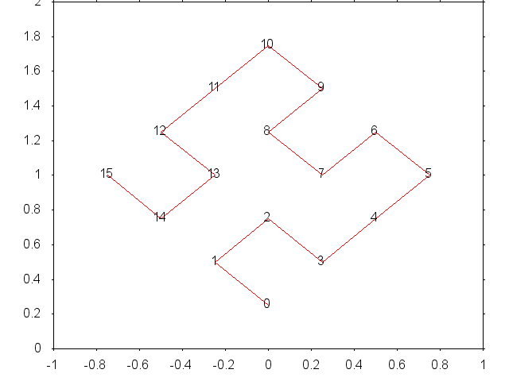

The accompanying file "spacefill.py" is both a Python library and
command-line utility to generate **space-filling curves** in
configurable coordinate systems.

For now the program supports both Hilbert__ (endpoints on the side)
and Moore__ (closed loop) curves.

.. __: https://en.wikipedia.org/wiki/Hilbert_curve
.. __: https://en.wikipedia.org/wiki/Moore_curve

`Space-filling curves`__ can be used for network layouts or job
scheduling as they have good locality-preserving properties: two
points with a close linear (1D) value are also close to each other in
the 2D space.

.. __: https://en.wikipedia.org/wiki/Space-filling_curve

The popular `XKCD Map of the Internet`__ is another example
application of Hilbert curves.

.. __: https://xkcd.com/195/

Example uses from the command line
==================================

Simply print the point coordinates of a 4-point Hilbert curve::

    $ ./spacefill.py 4
    0.0 0.0 0
    1.0 0.0 1
    1.0 1.0 2
    0.0 1.0 3

    # Redirect to a file:
    $ ./spacefill.py 4 -o hilbert-4.txt
    $ cat hilbert-4.txt
    0.0 0.0 0
    1.0 0.0 1
    1.0 1.0 2
    0.0 1.0 3

Pretty-print the curve using GNUplot ASCII art::

    $ ./spacefill.py 16 -g "dumb 40 15"
      3.5 +---+---+--+---+---+---+--+---+
        3 +  15     12******11*****10   +
      2.5 +   *      *              *   +
          |   *      *              *   |
        2 +  14*****13       8******9   +
      1.5 +                  *          +
        1 +   1******2       7******6   +
      0.5 +   *      *              *   +
          |   *      *              *   |
        0 +   0      3*******4******5   +
     -0.5 +---+---+--+---+---+---+--+---+
        -0.5  0  0.5 1  1.5  2  2.5 3  3.5

Same, with a Moore curve::

    $ ./spacefill.py 16 -g "dumb 40 15" -t moore
      3.5 +---+---+--+---+---+---+--+---+
        3 +   6******7*******8******9   +
      2.5 +   *                     *   +
          |   *                     *   |
        2 +   5******4      11*****10   +
      1.5 +          *       *          +
        1 +   2******3      12*****13   +
      0.5 +   *                     *   +
          |   *                     *   |
        0 +   1******0      15*****14   +
     -0.5 +---+---+--+---+---+---+--+---+
        -0.5  0  0.5 1  1.5  2  2.5 3  3.5

Output in a graphic format::

    $ ./spacefill.py 16 -g png -o hilbert4.png

You can use ``--fit`` to rotate the curve, for example 45 degrees
counter-clockwise::

    $ ./spacefill.py 4 -g png --fit 1 1 -1 1 -o hilbert4-rotated.png

Command-line API::

    $ ./spacefill.py --help
    usage: spacefill.py [-h] [--output OUTPUT] [--type TYPE] [--gnuplot [TERM]]
                        [--no-labels] [--fit C C C C] [--offset C C]
                        NPOINTS

    Generate Moore or Hilbert curves.

    positional arguments:
      NPOINTS               Desired number of points (must be power of 4).

    optional arguments:
      -h, --help            show this help message and exit
      --output OUTPUT, -o OUTPUT
                            Output file (default to stdout).
      --type TYPE, -t TYPE  Generate a curve of the specified type. (choices:
                            hilbert, moore)
      --gnuplot [TERM], -g [TERM]
                            Display the curve using GNUplot. The optional argument
                            indicates the GNUplot terminal type, defaults to
                            'dumb' (ASCII art).
      --no-labels           Do not print the point labels.
      --fit C C C C         Orient/size the curve according to the specified unit
                            vector coordinates. The first pair of values sets the
                            X vector; the second pair sets the Y vector. The
                            default defines a square that gives all points
                            positive coordinates at distance 1 from each other.
                            For example use N 0 0 M to fit in a rectangle of size
                            NxM oriented from the bottom left to the top right.
      --offset C C          Translate the curve to the specified position. The
                            default tries to position a corner of the curve at
                            coordinates (0,0).

API, example use from Python
============================

.. code:: python

    >>> import spacefill

    >>> h = spacefill.hilbert(1, 0, 0, 1, 0, 0, 1)
    >>> for x,y in h: print(x,y)
    0.25 0.25
    0.75 0.25
    0.75 0.75
    0.25 0.75

    >>> h = spacefill.moore(1, 0, 0, 1, 0, 0, 1)
    >>> for x,y in h: print(x,y)
    0.25 0.25
    0.25 0.75
    0.75 0.75
    0.75 0.25

Function documentation::

  hilbert(n, x0, y0, xi, xj, yi, yj)
      Generate a Hilbert curve.

      This function returns a generator that yields the (x,y) coordinates
      of the Hilbert curve points from 0 to 4^n-1.

      Arguments:
      n      -- the base-4 logarithm of the number of points (ie. the function generates 4^n points).
      x0, y0 -- offset to add to all generated point coordinates.
      xi, yi -- projection-plane coordinates of the curve's I vector (i.e. horizontal, "X" axis).
      xj, yj -- projection-plane coordinates of the curve's J vector (i.e. vertical, "Y" axis).

  moore(n, x0, y0, xi, xj, yi, yj)
      Generate a Moore curve.

      This function returns a generator that yields the (x,y) coordinates
      of the Moore curve points from 0 to 4^n-1.

      Arguments:
      n      -- the base-4 logarithm of the number of points (ie. the function generates 4^n points).
      x0, y0 -- offset to add to all generated point coordinates.
      xi, yi -- projection-plane coordinates of the curve's I vector (i.e. horizontal, "X" axis).
      xj, yj -- projection-plane coordinates of the curve's J vector (i.e. vertical, "Y" axis).
